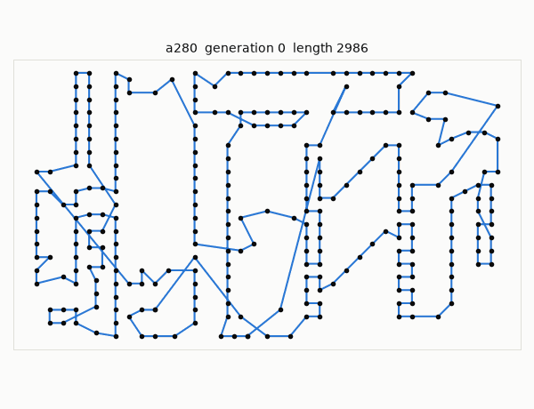
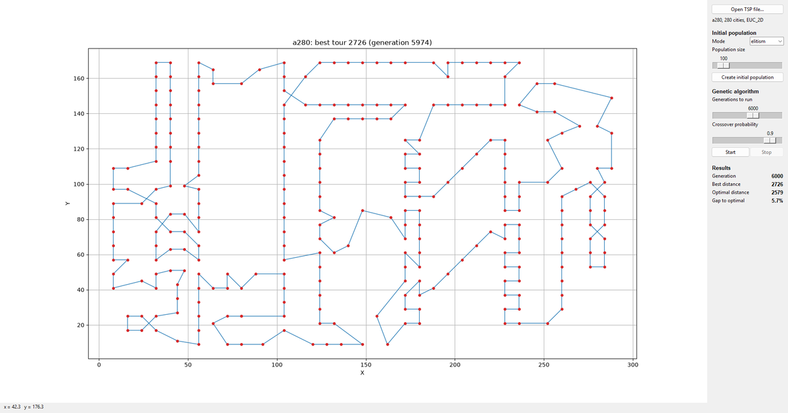
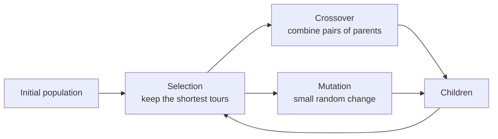
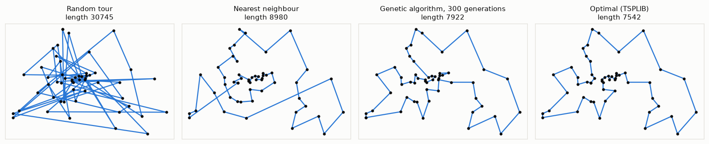
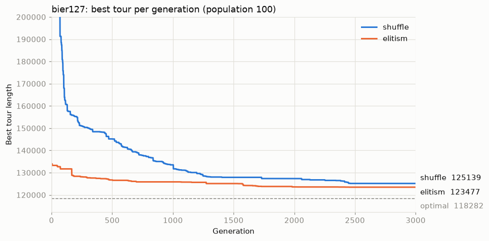

# TSP: solving the Travelling Salesman Problem with a Genetic Algorithm

A small, readable Python 3 project that solves the Travelling Salesman Problem
with a genetic algorithm. You can watch the tour improve live in a Tkinter GUI.
The code is written to be studied: every step of the algorithm is a short
function with comments explaining why it works the way it does.



## The problem

A salesman has to visit every city exactly once and return home. In which order
should he visit them to travel the shortest total distance?

The question is easy to state and very hard to answer. With *n* cities there are
(n-1)!/2 different round trips:

| Cities | Different tours |
|-------:|----------------:|
| 14     | 3.1 × 10⁹       |
| 52     | 7.8 × 10⁶⁵      |
| 127    | 1.2 × 10²¹¹     |

Checking them all is hopeless beyond a handful of cities. Instead, *heuristics*
like the genetic algorithm search for a very good tour in reasonable time,
without a guarantee that it is the best one.

## Quick start

You need Python 3 with Tkinter, which comes with the standard Windows and macOS
installers. On Linux it may be a separate package, e.g. `sudo apt install python3-tk`.
Tested on Python 3.12.

```
pip install -r requirements.txt
```

The only dependency is matplotlib, for the plots.

**GUI:**

```
python tsp_gui.py
```



1. **Open TSP file...** and pick a problem from `TSP_Problems/`. `berlin52.tsp` is a good start.
2. Choose how to create the **initial population** and its size, then
   **Create initial population**.
3. Choose how many **generations** to run and the **crossover probability**, then **Start**.
   **Stop** pauses the run. **Start** again continues from where it stopped.

When a known optimal tour exists for the problem, the *Results* box shows how far
the best tour found is from the optimum.

**Command line**, without the GUI:

```
python tsp_ga.py TSP_Problems/berlin52.tsp --generations 2000
python tsp_ga.py --help
```

**Tests:**

```
python -m unittest discover tests
```

## How the genetic algorithm works

A genetic algorithm imitates evolution. It keeps a *population* of candidate
solutions and improves it generation by generation. Good solutions survive and
are combined, and random changes keep bringing in new material.



**Representation.** A tour is a list of city numbers in visiting order, e.g.
`[1, 5, 3, 2, 4]`. The salesman returns from the last city to the first. Every
city must appear exactly once: a tour is a *permutation*.

**Fitness.** The length of a tour. The shorter the tour, the fitter it is.

### 1. Initial population, [`tsp_ga_init_pop.py`](tsp_ga_init_pop.py)

* **shuffle**: random tours. They are bad but very diverse.
* **elitism**: half are *nearest neighbour* tours, the other half random.
  Nearest neighbour is a greedy rule: always go to the closest city not yet visited.
  It is fast and decent, usually about 25% above the optimum. But it never looks
  ahead, so it ends with long edges back across the map. The GA starts much closer
  to a good solution.

### 2. Selection, `GeneticAlgorithm._select_survivors`

Parents and children compete together and only the shortest `population size`
tours survive. The best tour always survives, so the result can never get worse.
This is called *elitist* selection.

Duplicate tours are removed at this step. That one line matters a lot: without
it, copies of the best tour take over the whole population, every parent is the
same tour and the search gets stuck. This is called *premature convergence*. On
berlin52 it makes the difference between stalling near 8000 and reaching the
optimal 7542.

### 3. Crossover, [`tsp_ga.py`](tsp_ga.py)

A share of the survivors, the *crossover probability*, is paired up and each pair
produces two children.

**One-point crossover + repair.** Cut both parents at the same point and swap the tails:

```
parent_a  [1 2 3 | 4 5 6]        child_1  [1 2 3 | 6 2 5]   <- 2 twice, 4 missing
parent_b  [4 1 3 | 6 2 5]   ->   child_2  [4 1 3 | 4 5 6]   <- 4 twice, 2 missing
```

For tours this breaks the permutation rule, so a *repair* step removes the
duplicates and adds the missing cities back, usually as a small nearest
neighbour fragment.

**PMX (Partially Mapped Crossover).** It copies a segment from one parent and
fills the rest from the other. Cities that would appear twice are swapped
following the mapping between the two segments, so the children are always
valid tours and need no repair:

```
parent_a  [1 2 | 3 4 5 | 6 7]
parent_b  [3 7 | 5 1 6 | 4 2]
child     [6 7 | 3 4 5 | 1 2]
```

### 4. Mutation

The survivors that were not used for crossover are copied with one small random change:

| Mutation  | Example                         | Idea                                         |
|-----------|---------------------------------|----------------------------------------------|
| insertion | `[1 2 3 4 5] -> [1 3 4 2 5]`     | move one city somewhere else                 |
| swap      | `[1 2 3 4 5] -> [1 4 3 2 5]`     | exchange two cities                          |
| inversion | `[1 2 3 4 5 6] -> [1 5 4 3 2 6]` | reverse a segment                            |

Inversion is the most useful for the TSP. Reversing a segment replaces exactly
two edges of the tour, which is the classic **2-opt** move. It untangles two
crossing edges without disturbing the rest of the tour.

## Results

From a random tour to the optimum on berlin52. Nearest neighbour is far better
than random but leaves long edges behind. Three hundred generations of the GA
remove most of them:



Progress over the generations on bier127. Starting from nearest neighbour tours
(*elitism*) gives a large head start over random tours (*shuffle*). Both runs
improve quickly at first and then more and more slowly, the typical shape of a
GA run:



To recreate the figures, run `python docs/make_figures.py`.

## Distances

Each problem file declares an `EDGE_WEIGHT_TYPE`. The distances follow the
[TSPLIB](http://comopt.ifi.uni-heidelberg.de/software/TSPLIB95/) rules exactly,
so tour lengths can be compared with the published optimal values. The tests
check this on every problem that ships with an optimal tour.

* **EUC_2D**: the straight-line distance, rounded to the nearest integer.
* **GEO**: the coordinates are latitude and longitude in degrees.minutes format,
  and the distance is in kilometres over the surface of the Earth.

## Problems

`TSP_Problems/` holds problems from TSPLIB. The `.opt.tour` files are the known
optimal tours.

| Problem  | Cities | Type   | Optimal length |
|----------|-------:|--------|---------------:|
| burma14  |     14 | GEO    |           3323 |
| berlin52 |     52 | EUC_2D |           7542 |
| eil101   |    101 | EUC_2D |            629 |
| bier127  |    127 | EUC_2D |         118282 |
| a280     |    280 | EUC_2D |           2579 |
| d18512   |  18512 | EUC_2D |         645238 |

d18512 loads, but it is far too big for this algorithm. Treat it as a
stress test rather than something to solve.

## Project structure

| File                                       | What it does                                              |
|--------------------------------------------|-----------------------------------------------------------|
| [`tsp_parser.py`](tsp_parser.py)           | reads TSPLIB `.tsp` and `.tour` files into a `TSPProblem` |
| [`tsp_distance.py`](tsp_distance.py)       | TSPLIB `EUC_2D` and `GEO` distance functions              |
| [`tsp_ga_init_pop.py`](tsp_ga_init_pop.py) | initial population: random and nearest neighbour tours    |
| [`tsp_ga.py`](tsp_ga.py)                   | crossover, repair, mutation and the `GeneticAlgorithm`    |
| [`tsp_gui.py`](tsp_gui.py)                 | the Tkinter GUI                                           |
| [`tests/`](tests)                          | unit tests                                                |
| [`docs/make_figures.py`](docs/make_figures.py) | recreates the README figures                          |

## Ideas to try

Good exercises if you are studying the code:

1. Remove the duplicate check in `_select_survivors` and watch berlin52 get stuck.
2. Change `PMX_PROBABILITY` to 0 or 1. Which crossover works better?
3. Add **tournament selection**: pick parents by comparing a few random tours.
4. Implement **order crossover (OX)**, another classic permutation crossover.
5. Make the GA a *memetic algorithm*: after mutation, apply 2-opt until no
   reversal shortens the tour. Expect a big jump in quality.
6. Add the `ATT` or `CEIL_2D` distance types from the TSPLIB documentation.

## License

Apache 2.0, see [LICENSE](LICENSE).
